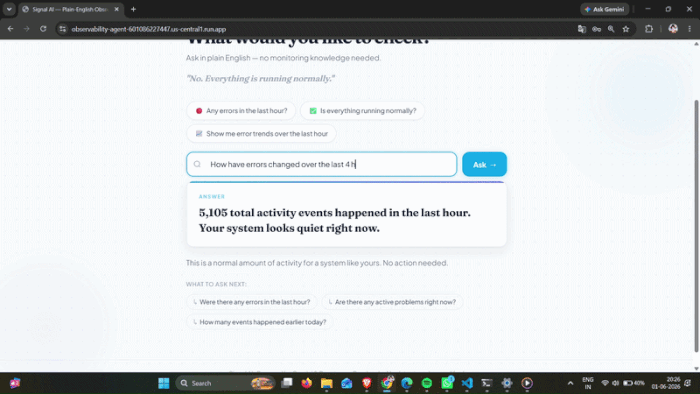
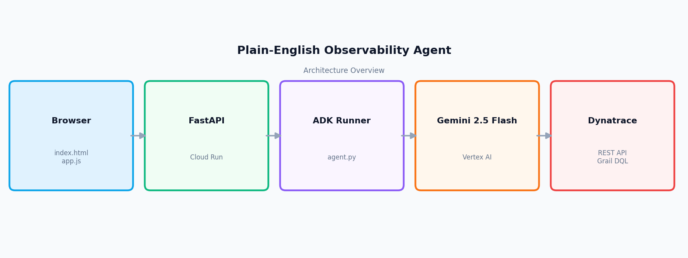

# Signal AI: Plain-English Observability Agent

**Ask questions about your system in plain English. Get real answers from live Dynatrace data — no query languages, no dashboards, no engineering degree required.**

**Live demo:** https://observability-agent-601086227447.us-central1.run.app

**Demo video:** https://youtu.be/fucFw-flVKw

**Track:** Google Cloud x Dynatrace AI Challenge

---



---

## The Problem

Dynatrace is powerful — but it is built for engineers. A non-technical founder or business owner cannot read a DQL query, interpret a dashboard, or know which metric to look at when something feels wrong.

**Meet Priya.** She runs an e-commerce business. She sees checkout is slow today but does not know if it is her server, a spike in errors, or just normal traffic. Her options are: ignore it, wait for the engineer, or open Dynatrace and get lost in dashboards she does not understand.

Signal AI gives Priya a third option. She types a question in plain English and gets one clear sentence back — backed by real data from her monitoring system.

**Example:**

> Priya asks: *"Were there any errors last night?"*

> Signal AI answers: **"Yes. 224 errors were recorded overnight."**
> "Most errors relate to application restarts and SSL handshake failures. These often resolve on their own and do not require immediate action. Worth monitoring over the next hour."

That is it. No dashboards. No queries. No engineer needed.

---

## How It Works

Every question goes through a fixed 5-step reasoning loop:

1. **Understand** — The agent reads the question, identifies the metric type (errors, activity, health, comparison, breakdown) and maps natural language time phrases ("last night", "today", "the last hour") to exact query timestamps.

2. **Write the query** — Based on the question type, the agent selects the right DQL pattern. A summary question runs three queries. A comparison runs two queries for separate time windows. A breakdown also fetches sample error content to name what kind of errors appeared.

3. **Execute** — The agent calls one of two tools: `run_dql()` for log and event queries, or `get_problems()` for active Davis AI alerts. Both tools hit the Dynatrace Grail REST API directly.

4. **Validate** — The agent checks that results are sensible. If values look wrong or empty, it retries once with a corrected query. If it still cannot verify, it flags the answer as uncertain.

5. **Translate** — The agent produces a plain-English answer with a headline (20 words maximum, starts with YES/NO or a number), a supporting paragraph, an optional chart, and 2-3 follow-up questions specific to what the data showed.

### Architecture

Quick overview of the five layers:



Detailed component view with data flows and security notes:


| Layer | Technology | Role |
|---|---|---|
| Frontend | HTML + CSS + JS + Chart.js | Two-screen SPA: connect screen then question interface |
| Backend | FastAPI on Cloud Run | Receives questions, rate limits, returns structured JSON |
| Agent | Google ADK + LlmAgent | Runs the 5-step reasoning loop |
| AI Model | Gemini 2.5 Flash on Vertex AI | Understands intent, writes queries, produces answers |
| Data | Dynatrace Grail REST API | Executes DQL against real log and event data |

---

## What Makes It Different

**It speaks the user's language, not the tool's language.**
Most observability tools require users to learn the tool. Signal AI flips that — the user asks in plain English and the AI handles the query layer entirely.

**Answers are opinionated, not just data dumps.**
The agent does not return raw numbers. It interprets them: "28 errors, most are application restart events which are harmless" is a different answer than just "28 errors".

**Follow-up questions keep the investigation moving.**
After every answer, 2-3 contextual follow-up chips appear. They are generated from the actual data returned, not generic templates. A user who does not know what to ask next always has a next step.

**Two modes: your data or the demo.**
Users can connect their own Dynatrace account with a read-only API token, or use the built-in Dynatrace Playground demo that runs against live monitoring data with no setup required.

---

## Try It

The live demo runs against a real Dynatrace Playground environment with live data.

**Steps:**
1. Open https://observability-agent-601086227447.us-central1.run.app
2. Click **"Use demo account (Dynatrace Playground)"** — no credentials needed
3. Type a question or click one of the example chips
4. Read the answer, then click a follow-up chip to keep exploring

**Suggested questions to try:**
- "Are there any errors in the last hour?"
- "Tell me the summary of my system"
- "Is everything running normally?"
- "Show me error trends over the last hour"
- "Compare today's errors to yesterday"
- "Are there any active problems I should know about?"
- "What kind of errors happened last night?"

**Note on the Playground data:**
The demo connects to a Windows machine monitored by Dynatrace OneAgent. It shows real system logs — Windows service events, application errors, background process activity. It does not show web traffic, user logins, or checkout events because there is no application-level monitoring connected. The agent knows this and will say so honestly if asked about those topics.

---

## Tech Stack

| Layer | Technology | Version |
|---|---|---|
| AI model | Gemini 2.5 Flash | via Vertex AI |
| Agent framework | Google ADK (LlmAgent + Runner) | 1.10.0 |
| Backend server | FastAPI | 0.136.3 |
| Hosting | Google Cloud Run | n/a |
| Data source | Dynatrace Grail REST API | v1 |
| HTTP client | httpx | 0.28.1 |
| Frontend charts | Chart.js | 4.4.2 |
| Secret management | GCP Secret Manager | n/a |

---

## Run Locally

**Prerequisites:** Python 3.11+, a GCP project with Vertex AI enabled, a Dynatrace tenant with a Platform Token.

**1. Clone the repository**
```bash
git clone <your-repo-url>
cd Plain-English-Observability-Agent
```

**2. Create and activate a virtual environment**
```bash
python -m venv .venv

# Windows
.venv\Scripts\activate

# macOS / Linux
source .venv/bin/activate
```

**3. Install dependencies**
```bash
pip install -r backend/requirements.txt
```

**4. Configure environment variables**
```bash
cp .env.example .env
```

Fill in the three values in `.env`:
```
DT_TENANT_URL=https://your-tenant.apps.dynatrace.com
DT_PLATFORM_TOKEN=dt0...
GOOGLE_CLOUD_PROJECT=your-gcp-project-id
```

Your Dynatrace Platform Token needs these scopes:
- `storage:logs:read`
- `storage:metrics:read`
- `storage:events:read`
- `storage:entities:read`

**5. Start the server**
```bash
cd backend
uvicorn main:app --reload --port 8080
```

Open `http://localhost:8080` in your browser.

**6. Test with curl**
```bash
curl -X POST http://localhost:8080/ask \
  -H "Content-Type: application/json" \
  -d '{"question": "Are there any errors in the last hour?"}'
```

Expected response shape:
```json
{
  "headline": "Yes. 28 errors were recorded in the last hour.",
  "paragraph": "Most errors relate to application restarts and background service events...",
  "chart_data": null,
  "uncertainty": false,
  "needs_clarification": false,
  "followup_questions": [
    "What kind of errors appeared most often?",
    "How does this compare to yesterday?"
  ]
}
```

---

## Project Structure

```
Plain-English-Observability-Agent/
|
+-- backend/
|   +-- main.py              FastAPI app: /ask, /health, rate limiter, CORS, security headers
|   +-- agent.py             LlmAgent with run_dql() and get_problems() tools
|   +-- system_prompt.txt    5-step loop, question type patterns, 8 hard rules
|   +-- answer_parser.py     Converts raw agent text output into typed JSON
|   +-- eval.py              10-question automated scoring runner
|   +-- eval_questions.json  Fixed test question set with expected behaviours
|   +-- requirements.txt     Pinned Python dependencies
|   +-- Dockerfile           python:3.11-slim, non-root user, port 8080
|
+-- frontend/
|   +-- index.html           Connect screen + app screen, CSP meta tag
|   +-- app.js               State machine, chip handlers, chart rendering
|   +-- style.css            Design system, spinner, mobile breakpoint
|
+-- docs/
|   +-- architecture_overview.png   5-box overview diagram
|   +-- architecture.png            Detailed component diagram
|
+-- .env.example             Template for local environment variables
+-- LICENSE                  MIT
```

---

## What I Built and Learned

- **Prompt engineering for consistent structure is harder than it looks.** Getting Gemini to reliably output HEADLINE/PARAGRAPH/FOLLOWUP/CHART in the right format, every time, across all question types, required many iterations of the system prompt. A single ambiguous rule caused unpredictable output across question types.

- **LLM agents need guardrails, not just instructions.** The agent needed explicit hard rules (never use em dashes, never put breakdown details in the headline, never claim to see data that is not there) because the model would confidently produce plausible-sounding but wrong answers without them.

- **MCP was not available on trial tenants.** The original plan used the Dynatrace MCP gateway, but trial tenants return 404 on that endpoint. Pivoting to direct Dynatrace REST API calls (httpx + DQL) turned out to be simpler and faster anyway.

- **Stateless sessions prevent subtle bugs.** Creating a fresh `InMemorySessionService` per request means no state leaks between users. The trade-off is no multi-turn memory, but for the use case (one question, one answer) this is the right default.

---

## Known Limitations

- **Windows system logs only.** The Dynatrace Playground monitors a Windows machine via OneAgent. There is no application-level instrumentation, so questions about web traffic, user logins, checkout flows, or customer counts cannot be answered from real data. The agent is honest about this.

- **Response time is 10-20 seconds.** Summary and breakdown questions run up to 4 sequential DQL queries before producing an answer. This is inherent to the multi-step agent approach and the Dynatrace API response time.

- **No conversation memory across questions.** Each question is independent except for immediate follow-ups (which carry the previous question as silent context). The agent does not remember what was discussed earlier in the session.

- **Rate limited to 20 questions per minute per IP.** This is intentional to prevent abuse, but means rapid automated testing triggers 429 errors.

---

## License

MIT. See [LICENSE](LICENSE) for details.

---

*Built for the Google Cloud x Dynatrace AI Challenge.*
